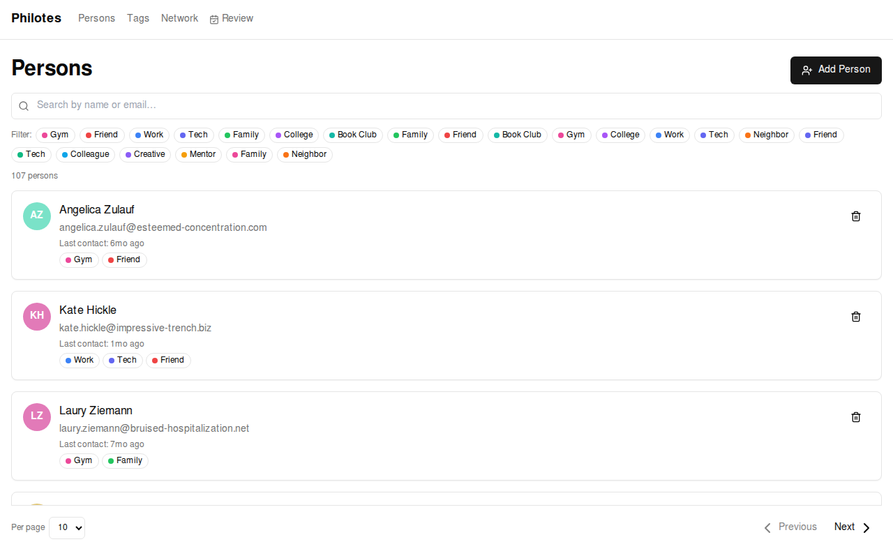
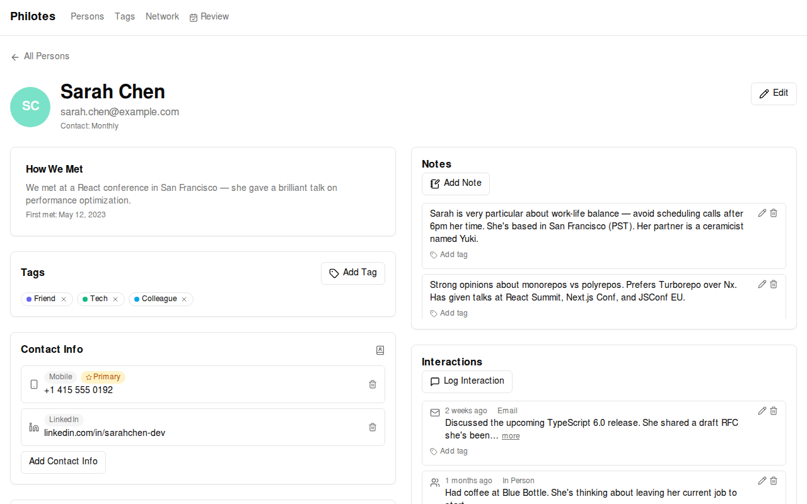
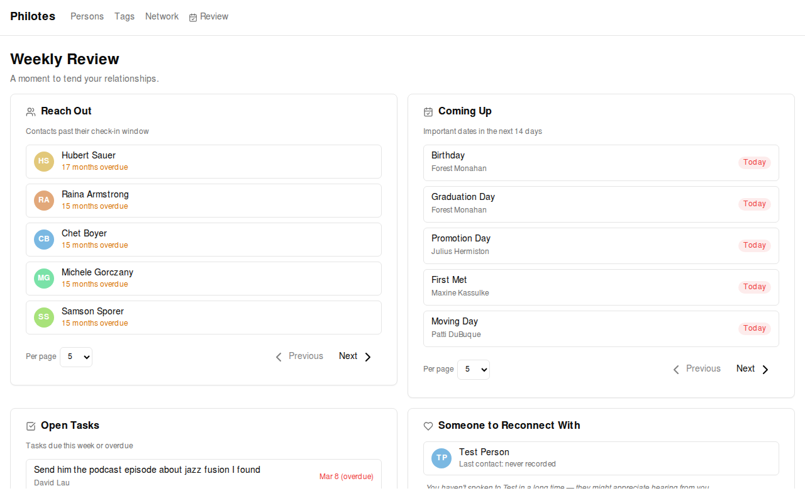
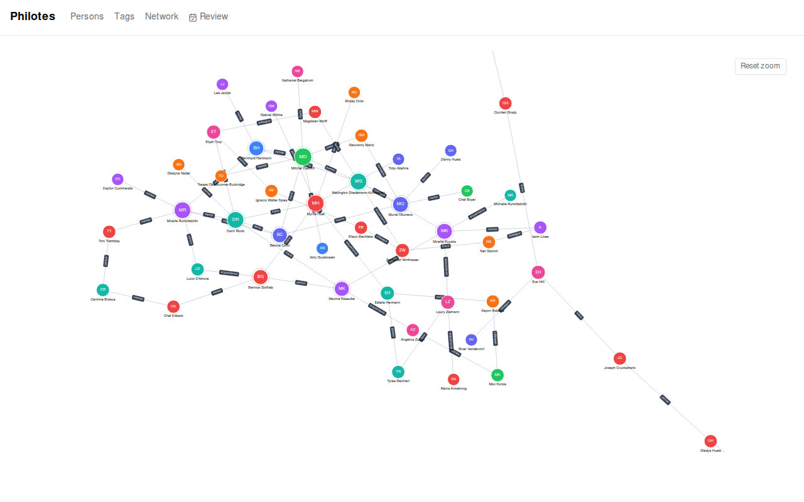

# Philotes

**A personal CRM for the people who matter to you — not your pipeline.**

Most CRMs are built for sales. Philotes is built for life. It helps you stay
connected to the people you actually care about: friends, family, colleagues,
mentors. No quotas, no funnels, no subscriptions. Just your relationships, on
your machine.

Philotes (Φιλότης) is the Greek goddess of friendship and affection. It felt
like the right name.

---



---

## Why Philotes?

Life moves fast and relationships slip through the cracks. You forget to follow
up, you lose track of how you met someone, you can't remember if it was their
birthday or their kid's birthday. Philotes gives you a quiet place to keep that
context — so you can show up for the people in your life.

It runs 100% locally. No account to create, no cloud to trust, no vendor to
worry about. Your data lives on your machine, in an embedded Postgres database,
and nowhere else.

---

## Features

- **People** — name, email, avatar, how you met, preferred contact frequency
- **Interactions** — log touchpoints (in-person, phone, email, video, etc.) with channel, sentiment, and notes
- **Notes** — free-form notes with `@mention` support to link other contacts
- **Important Dates** — birthdays, anniversaries, and any other recurring or one-off significant date
- **Labels & Tags** — flexible tagging across people, notes, and dates
- **Relationships** — track how people are connected to each other (friend, colleague, custom types)
- **Contact Info** — phone numbers, social handles, URLs
- **Addresses** — home, work, and more
- **Activities & Tasks** — things to do with or for someone
- **Suggested Introductions** — surfaces people who share labels but aren't yet connected
- **Network View** — a graph of your relationships
- **Review Page** — a to-do-style overview for pending follow-ups

---

### Person Detail



### Weekly Review



### Relationship Network



---

## Getting Started

You'll need **Node.js 22+** and **npm**.

```bash
git clone https://github.com/vantreeseba/philotes.git
cd philotes
npm install
npm run dev
```

The app opens at [http://localhost:3000](http://localhost:3000). That's it — no
database to set up, no environment variables required.

---

## Tech Stack

| Layer    | Technology                                                  |
| -------- | ----------------------------------------------------------- |
| Frontend | React 19, Vite, TanStack Router, Apollo Client              |
| UI       | Tailwind CSS, shadcn/ui, Radix UI                           |
| API      | Apollo Server, GraphQL                                      |
| Database | Drizzle ORM, PGlite (embedded Postgres — no server needed)  |
| Testing  | Vitest                                                      |
| Linting  | Biome                                                       |
| Runtime  | Node.js 22+, ESM                                            |

---

## Development

```bash
npm run dev          # Start the app and API server together
npm test             # Run the test suite
npm run check        # Codegen, lint, and type-check
npm run db:studio    # Open Drizzle Studio to browse the local database
```

---

## Running with Docker

Philotes ships with a multi-stage Alpine-based Dockerfile. The container runs the
GraphQL API and serves the built frontend — no separate web server needed.

**Build the image:**
```bash
docker build -t philotes .
```

**Run with persistent data:**
```bash
docker run -d \
  -p 3001:3001 \
  -v philotes-data:/data \
  -v philotes-avatars:/avatars \
  --name philotes \
  philotes
```

Then open [http://localhost:3001](http://localhost:3001).

**Volumes:**
| Volume | Purpose |
| --- | --- |
| `/data` | PGlite database files (persists your contacts) |
| `/avatars` | Uploaded avatar images |

**Environment variables:**
| Variable | Default | Description |
| --- | --- | --- |
| `PORT` | `3001` | Port the server listens on |
| `DATABASE_URL` | `/data/pgdata` | Path to the PGlite database directory |

---

## License

MIT
